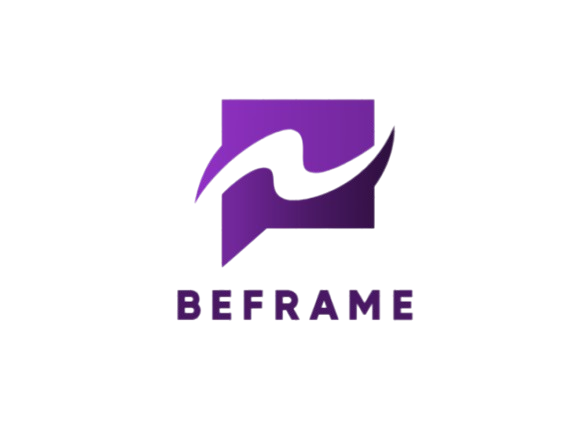

# 📸 BEFRAME

**_Conecte, compartilhe, inspire._**



---

## 🧠 Sobre o projeto

**BEFRAME** é uma rede social moderna e minimalista, inspirada na estética clean e nas funcionalidades do Instagram. O nome "BEFRAME" remete à ideia de "enquadrar momentos" — como se cada postagem fosse um quadro de uma galeria pessoal. A logo representa esse conceito com uma moldura estilizada em tons de roxo, remetendo à criatividade, conexão e expressão individual.

---

## 🎨 Identidade Visual

- **Cores principais:**  
  - Roxo degradê (#6A0DAD a #A020F0) — Criatividade e sofisticação  
  - Branco — Simplicidade e clareza  
  - Lilás (#EBDDFB) — Conforto visual e acessibilidade

- **Fonte recomendada:** Montserrat ou Poppins, para transmitir modernidade e legibilidade.

---

## 🚀 Funcionalidades principais

- Postar fotos com descrições  
- Curtir e comentar publicações  
- Tela de feed com postagens recentes  
- Perfil de usuário com avatar, bio e galeria  
- Armazenamento e autenticação com Firebase  
- Armazenamento local com AsyncStorage  

---

## 📦 Tecnologias e pacotes utilizados

Este projeto utiliza **React Native** com **Expo**. Os principais pacotes são:

```bash
npx expo install @react-native-async-storage/async-storage
npm install firebase
npm install @react-navigation/bottom-tabs
npx expo install react-native-web react-dom @expo/metro-runtime
npm install @react-navigation/native-stack
npm install @react-navigation/native
expo install @expo/vector-icons
expo install expo-image-picker
```

---

## 🛠️ Como rodar o projeto

> ⚠️ Este repositório **não contém a pasta `node_modules`**. Você precisa iniciar um app do zero com Expo.

### 1. Instale o Expo CLI (caso não tenha)
```bash
npm install -g expo-cli
```

### 2. Crie um novo projeto Expo
```bash
npx create-expo-app beframe
cd beframe
```

### 3. Substitua o conteúdo do projeto
- Delete os arquivos gerados automaticamente (como `App.js`, `assets`, etc).
- Clone os arquivos deste repositório no diretório criado:

```bash
git clone https://github.com/seu-usuario/seu-repositorio.git .
```

> **Atenção ao ponto (`.`) no final do comando acima!** Isso garante que o conteúdo seja copiado para o diretório atual.

### 4. Instale as dependências necessárias
Execute os comandos abaixo um por um:

```bash
npx expo install @react-native-async-storage/async-storage
npm install firebase
npm install @react-navigation/bottom-tabs
npx expo install react-native-web react-dom @expo/metro-runtime
npm install @react-navigation/native-stack
npm install @react-navigation/native
expo install @expo/vector-icons
expo install expo-image-picker
```

### 5. Rode o projeto
```bash
npx expo start
```

---

## 📱 Pré-visualização

> A pré-visualização estará disponível após o primeiro build. Escaneie o QR code com o app Expo Go.

---

## 🤝 Contribuição

Contribuições são bem-vindas! Se quiser sugerir melhorias ou relatar bugs, abra uma issue ou envie um pull request.
